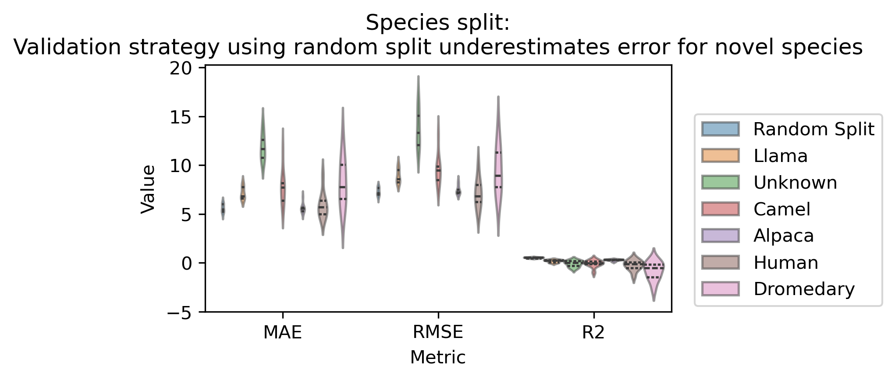
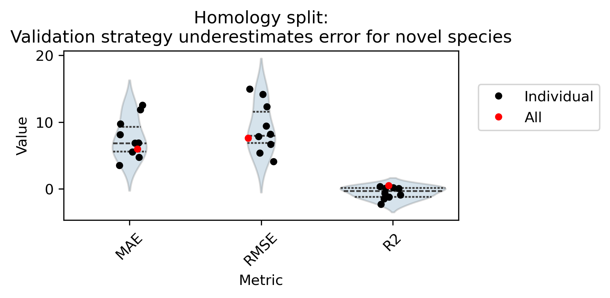
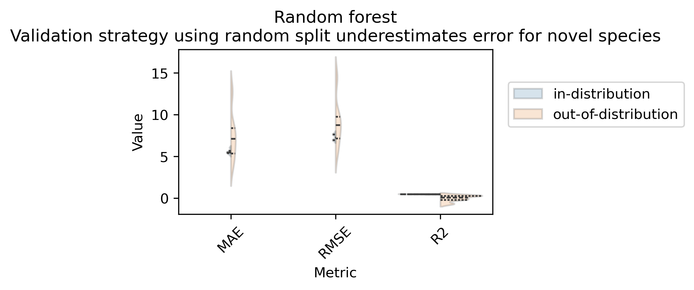

# Sensitivity and Uncertainty of Machine learning models

The goal of this repository is to highlight challenges when training predictive models in biomedical science with limited data availability and shifts in data distributions which are hard to forsee and hard to predict. On the example of a small model for the prediction of nanobody melting temperature, we will highlight a common pitfall when training models based on sequences. Notably, sequences which are highly similar to sequences which have been 'seen' by the model during training are easier to predict than sequences which are dissimilar. The question a user of the model will have is how well they can expect their model to perform on data which is dissimilar to the sequences in the training data.

Bernett et. al [3] have shown that many protein-protein interaction tools heavily rely in homology to predict interactions. They have shown that when training on randomly split data sets, the prediction accuracies are really high. However, accuracies drop when spliting the training data in such a way, that the homology between the training and test sets are reduced. 

This is not only a problem for sequence data. In many predictive tasks, a major question is whether good test accuracies on the test split of the training data translate well into real life. In the biomedical domain, data is ridden with batch effect, systematic shifts in the data, which may lead to a drastic drop in performance when the predictor is used on the novel data set. Usually the performance of a model trained on data from one hospital is worse on data from a different hospital. 

## Data
NbThermo [1] is a literature curated database containing 567 nanobody (smaller antibodies) sequences, their melting temperature and various metadata such as experimental technique. [Link to data analysis](database.md)

## Model
TEMPRO [2] is a model specifically designed and train to predict the melting temperature of shorter peptide sequences. The authors claim that their model achieves superior performance to existing models and baseline, 'standard' machine learning predictors. The authors use a well established approach to training their model, creating an 80:20 train:test split. 

### Changes to the tempro model in this repository
- Early stopping has been intoduced to avoid excessive training, as the model tends to overtrain quickly due to the lack of data.
- A smaller model for the embedding sizes has been used for quicker training. The embeddings can be drop-in replaced with larger embedding models if required.
- The test setup has been modified to include a train-test-validation split, where the data is initally split into two 

## Research question:
The question we are adressing whether the improved accuracies of the deep learning models in TEMPRO drop when using a biased split for training and testing. Unlike a random split, a biased split does not distributed the samples in an iid fashion into training, test and validation split. Instead, the grouping variables in the data are used to create training and test datasets. 

Here we investigate two biased splits, based on the metadata and based on the sequence homology in the training data, and compare it to the baseline model of a random split.

### Metadata based split:
In the metadata in the training data used for the TEMPRO model the species of origin is annotated. Instead of splitting the data randomly, we split by species in a crossvalidation setup. Each species is used as a independent hold-out data set once, meaning the data is trained on all other species, and the final test accuracies are computed on the held out species. Within the training data, we use an 80:20 split again to train and compute the current model performance respectivly. In the plot below, we show the Mean Absolute Error (MAE), the Root Mean Squared Error (RMSE) and the $R^2$ values for the crossvalidation setup. For reference, we also show the performance of the 'regular' training setup where we first split the data 80:20 and use the 20 percent as the independent hold out data set and the remaining 80% are split once again for the training loop. As we can see, the MAE and RMSE  are lower for the 'standard' random setup, that when the data is split according to species. This means that, when using the model, we will be able to predict the melting temperature of peptides reasonably well, if we have a peptide that stems from one of the species we trained on. On the other hand, if we have a peptide from another organism, we have to expect a drop in performance for the model. This is expected to be even worse for species that are further removed from camels.

### Homology based split:
The alignment distance between two sequences roughly describes the evolutionary distance between two sequences. Very similar sequences in two species are called homologs. Homology often is good predictor for a similar function or structure. Since homologous sequences are likely to occur in our dataset and the species in the dataset are closely related, the model may be able to predict the thermostability of a sequence because it has seen a homologous sequence in another species. Therefore, in order to understand how well the model will be able to predict sequences for which no homolog appeared in the training data, we grouped the data into homologous groups and held out each group one. The members of each group are closer to each other than to all other sequences in the dataset.

For the homology based split, we used computed the pairwise alignment distance between all training sequences from the database based on the BLOSUM90 matrix which is a substitution matrix for high sequence similarity, as most of the species in the data base are from the group of camelidae. We clustered this precomputed distance matrix using spectral clustering to obtain a predefined number of homology clusters, which we included in the metadata. We then used this grouping to perform a similar validation as described above. The plot below shows the baseline random split versus splits acounting for similarity.

## Comparison with other models
Finally, for fairness, we used the same strategy for one of the baseline ML model described in the TEMPRO paper. Here we trained a random forest regressor using each species as an independent hold-out dataset once and computed the error metrics. As we can see, the error increases even more dramatically, meaning that the DL learning model is somewhat less sensitive to shifts in data distribution than the random forest classifier.

## Conclusion
Overall, when testing predictors there should always be an independent hold-out dataset. Furthermore, if you expect a shift in distribution from training to prediction time, this should be anticipated during the training and, as far as possible the validation strategy should include measures for the expected drop in accuracy during inference.

## References:

[1] Mario S Valdés-Tresanco, Mario E Valdés-Tresanco, Esteban Molina-Abad, Ernesto Moreno, NbThermo: a new thermostability database for nanobodies, Database, Volume 2023, 2023, baad021, https://doi.org/10.1093/database/baad021
[2]Alvarez, J.A.E., Dean, S.N. TEMPRO: nanobody melting temperature estimation model using protein embeddings. Sci Rep 14, 19074 (2024). https://doi.org/10.1038/s41598-024-70101-6
[3] Judith Bernett, David B Blumenthal, Markus List, Cracking the black box of deep sequence-based protein–protein interaction prediction, Briefings in Bioinformatics, Volume 25, Issue 2, March 2024, bbae076, https://doi.org/10.1093/bib/bbae076
