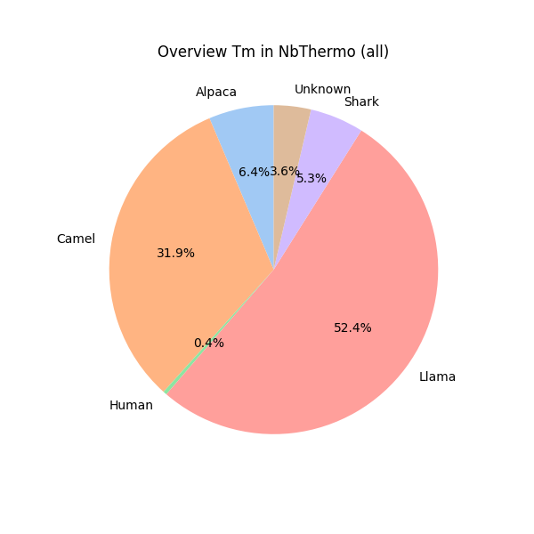
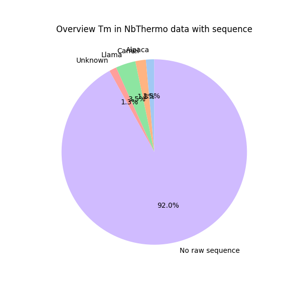
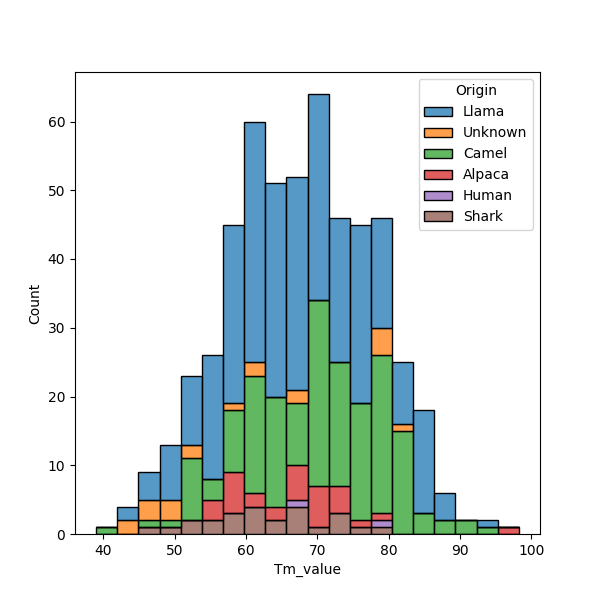

## NbThermo database content

More than 90% of the database contains Camelidae family.

The metadata contains experimental values for the melting temperature of the antibodies, however for most of the entries (92%) there is no sequence available.

The melting temperature per species varies, where the Sharks have the lowest mean Tm and Camels have the highest average Tm.

| Species | mean | std | 
|----------|----------|----------|
| Llama | 66.9 | 9.9 |
| Camel | 70.2 | 9.6 |
| Alpaca | 66.7 | 8.9 |
| Shark | 62.6 | 8.1 |

Source: `scripts/1_GetJson.ipynb`.