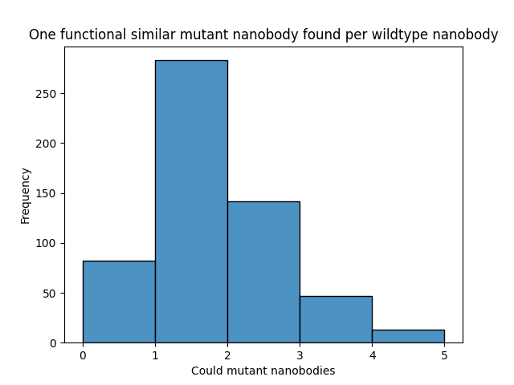
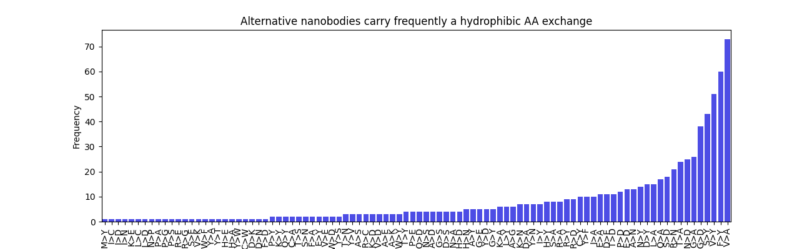
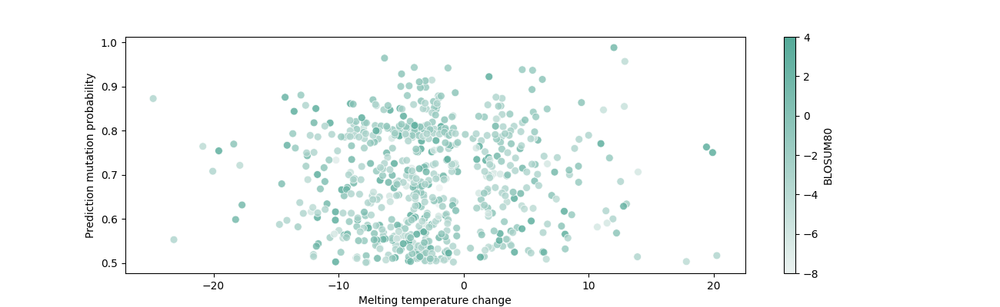
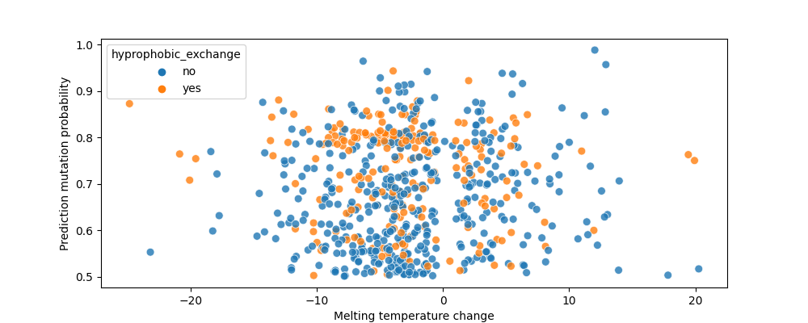

# Identify mutant thermostable nanobodies with conserved function

We showcase the applicability of ML models for a potential real-world application. The question we ask is: "Can we identify alternative nanobodies that (1) are more thermostable than the wildtype and (2) preserve the wildtype's function and structure?"

### Table of contents

- [Motivation](#motivation)
- [Predict mutant nanobodies with conserved function using nanoBert](#step1)
- [Predict the 3D structure of the wildtype and mutant nanobodies using AlphaFold2](#step2)
- [Predict  melting temperature for the mutant nanobodies using TEMPRO](#step3)
- [Select putative thermostable mutant nanobodies](#step4)
- [Results and conclusions](#conclusions)

## Motivation 

Finding thermostable nanobodies is important because they offer enhanced stability under extreme conditions, making them more suitable for a variety of real-world applications, including:

#### Improved Shelf Life and Storage:

Thermostable nanobodies can be stored and transported without refrigeration, crucial for global distribution, especially in regions with limited cold-chain infrastructure. This is particularly beneficial for healthcare in underdeveloped areas.

#### Enhanced Performance in Diagnostics and Therapeutics:

In diagnostic tools, thermostable nanobodies maintain functionality over a wider range of temperatures, ensuring reliability in point-of-care settings. In therapeutics, they remain effective in the human body under physiological stress, improving drug stability.

#### Industrial Applications:

Thermostable nanobodies are valuable in harsh industrial environments, such as in biotechnology and pharmaceutical manufacturing, where high temperatures are required for certain processes.

## 1. Predict mutant nanobodies with conserved function using nanoBert 

We uses a collection of `567 nanobodies` to predict alternative/mutated nanobodies, which are predicted to be functional similar to the wildtype. We used for this, `nanoBERT`, which is a nanobody-specific transformer. Its primary application is positing infilling, predicting what amino acids could be available at a given position according to the nanobody-specific distribution.  

We extracted for every nanobody the sequence of the `CDR3` loop and predicted functional related amino-acids for each position in the CDR3 sequence. We kept only the predictions with a `probability > 0.5`, which resulted in more than 700 alternative nanobodies. In average one mutant nanobody was predicted per wildtype nanobody with `probability > 0.5`.

Our analysis of the functional predictions for amino-acid exchanges reveals that the predicted mutant nanobodies frequently exhibit hydrophobic substitutions. This observation aligns with the fact that the flanking regions of the CDR3 loops are inherently hydrophobic. The most frequent exchange is V (Val) > A (Ala).

## 2. Predict the 3D structure of the wildtype and mutant nanobodies using AlphaFold2 

For a selection of mutated and wildtype nanobodies we performed 3D structure prediction using AlphaFold2 (https://neurosnap.ai/service/AlphaFold2).

## 3. Predict Tm for the mutant nanobodies using TEMPRO 

We predicted the melting temperature for the 700+ alternative nanobodies using the TEMPRO prediction model.

## 4. Select putative thermostable mutant nanobodies 

We are interested to select mutant nanobodies candidates which are more thermostable compared to wildtype, i.e. the melting temperature of the mutant(Tm_mut) is higher compared to the wildtype (Tm_wt). 

We first look at the temperature changes between Tm_wt and Tm_mut accross all predictions and observe that many of the predicted alternative nanobodies have lower predicted melting temperature. 

For this purpose we keep in our dataset predictions which have:

- keep only entries for the Tm_wt was predicted accurately (close to experimental Tm)
- mutation probability > 0.5 according to nanoBERT
- BLOSUM80 for the aa exchange > -1 
- Tm_mut - Tm_wt > 3 degrees

[Top hits](predictions/mutated_seq_with_predictions_tophits.csv)

|id     |tm  |crd3                    |wt_seq|position|wt                                                                                                                                                          |mut|mut_seq                                                                                                                                                |prob_mut          |predictions|TEMPRO   |diff_pred_mut_vs_tm|diff_pred_mut_vs_tempro|conf               |crd3_pos_mut|crd3_len|crd3_pos_mut_rel    |BLOSUM62|BLOSUM80|mutations|hyprophobic_exchange|
|-------|----|------------------------|------|--------|------------------------------------------------------------------------------------------------------------------------------------------------------------|---|-------------------------------------------------------------------------------------------------------------------------------------------------------|------------------|-----------|---------|-------------------|-----------------------|-------------------|------------|--------|--------------------|--------|--------|---------|--------------------|
|sdab7  |55.0|ASGRYLGGITSYSQGDFAP     |S     |98      |EVQLQASGGGLVQAGDSLRLSCVAVSGRTISTFAMGWFRQAPGKEREFVATINWSGSSARYADPVEGRFTISRDDAKNTVYLEMSSLKPGDSAVYYCA<mask>GRYLGGITSYSQGDFAPWGQGTQVTVSS                        |A  |EVQLQASGGGLVQAGDSLRLSCVAVSGRTISTFAMGWFRQAPGKEREFVATINWSGSSARYADPVEGRFTISRDDAKNTVYLEMSSLKPGDSAVYYCAAGRYLGGITSYSQGDFAPWGQGTQVTVSS                        |0.7786890268325806|60.946945  |56.71909 |5.9469449999999995 |4.227854999999998      |0.7109288886983146 |1           |19      |0.05263157894736842 |1.0     |2.0     |S>A      |no                  |
|sdab8  |55.0|ASGRYLGGITSYSQGDFAP     |S     |98      |EVQLQASGGGLVQAGDSLRLSCVAVSGRTISTFAMGWFRQAPGKEREFVATINWSGSSARYADPVEGRFTISRDDAKNTVYLEMSSLKPGDSAVYYCA<mask>GRYLGGITSYSQGDFAPWGQGTQVTVSSAAAGAGGSGGAPASNRCSQGSCWN|A  |EVQLQASGGGLVQAGDSLRLSCVAVSGRTISTFAMGWFRQAPGKEREFVATINWSGSSARYADPVEGRFTISRDDAKNTVYLEMSSLKPGDSAVYYCAAGRYLGGITSYSQGDFAPWGQGTQVTVSSAAAGAGGSGGAPASNRCSQGSCWN|0.7060571908950806|62.288208  |55.864964|7.288207999999997  |6.423243999999997      |0.8813200720945394 |1           |19      |0.05263157894736842 |1.0     |2.0     |S>A      |no                  |
|sdab32 |57.9|HALIKNELGFLDY           |H     |95      |QVQLVESGGGLVQPGESLRLSCAASGSIFGIYAVHWFRMAPGKEREFTAGFGSHGSTNYAASVKGRFTMSRDNAKNTTYLQMNSLKPADTAVYYC<mask>ALIKNELGFLDYWGPGTQVTVSS                                |N  |QVQLVESGGGLVQPGESLRLSCAASGSIFGIYAVHWFRMAPGKEREFTAGFGSHGSTNYAASVKGRFTMSRDNAKNTTYLQMNSLKPADTAVYYCNALIKNELGFLDYWGPGTQVTVSS                                |0.685815155506134 |63.585903  |58.76032 |5.685903000000003  |4.825583000000002      |0.8486924592276722 |0           |13      |0.0                 |1.0     |1.0     |H>N      |no                  |
|sdab37 |53.6|SARSRGYVLSVLRSVDSYDY    |S     |101     |GPHMAQVQLVESGGRLVQAGDSLRLSCAASGRTFSTSAMAWFRQAPGREREFVAAITWTVGNTILGDSVKGRFTISRDRAKNTVDLQMDNLEPEDTAVYYC<mask>ARSRGYVLSVLRSVDSYDYWGQGTQVTVS                    |A  |GPHMAQVQLVESGGRLVQAGDSLRLSCAASGRTFSTSAMAWFRQAPGREREFVAAITWTVGNTILGDSVKGRFTISRDRAKNTVDLQMDNLEPEDTAVYYCAARSRGYVLSVLRSVDSYDYWGQGTQVTVS                    |0.9885804057121276|65.629944  |53.97755 |12.029943999999993 |11.652393999999994     |0.9686158140054517 |0           |20      |0.0                 |1.0     |2.0     |S>A      |no                  |
|sdab53 |58.6|ALSARWYKRAEPDFDY        |F     |110     |QVQLQESGGGSVQAGGSLRLSCEVSGYSETTYRIGWFRLPPGLETREEVAFINFGGDSTLYANSVKGRFTISQDNTKNTVYLLMNSLKPEDTAIYYCALSARWYKRAEPD<mask>DYWGQGTQVTVSS                           |Y  |QVQLQESGGGSVQAGGSLRLSCEVSGYSETTYRIGWFRLPPGLETREEVAFINFGGDSTLYANSVKGRFTISQDNTKNTVYLLMNSLKPEDTAIYYCALSARWYKRAEPDYDYWGQGTQVTVSS                           |0.7707083821296692|69.5876    |59.519436|10.987599999999993 |10.068163999999996     |0.916320579562416  |13          |16      |0.8125              |3.0     |4.0     |F>Y      |yes                 |
|sdab130|51.5|STGALLPTRP              |S     |96      |DVQLQESGGGLVQPGGSLRLSCAASGFLFSDTYMTWARQAPGKGLEWLGGISKDGSGTLYEDSVEGRFTISRDNAKNTLYLQMNSLKSEDTALYYC<mask>TGALLPTRPQGQGTQVTVSS                                  |A  |DVQLQESGGGLVQPGGSLRLSCAASGFLFSDTYMTWARQAPGKGLEWLGGISKDGSGTLYEDSVEGRFTISRDNAKNTLYLQMNSLKSEDTALYYCATGALLPTRPQGQGTQVTVSS                                  |0.7591122388839722|56.026825  |52.288837|4.526825000000002  |3.7379880000000014     |0.825741662202537  |0           |10      |0.0                 |1.0     |2.0     |S>A      |no                  |
|sdab180|66.0|AASNRGSLYTLDNQNRYED     |E     |113     |QVQLVESGGGPVEAGGSLRLSCAASGRSFSNSVMAWFRQAPGKEREFLSVLNWSSGRTSIADSVKGRFTMSRDPAKITVYLQMNGLKPEDTAVYYCAASNRGSLYTLDNQNRY<mask>DWGQGTQVTVSS                         |D  |QVQLVESGGGPVEAGGSLRLSCAASGRSFSNSVMAWFRQAPGKEREFLSVLNWSSGRTSIADSVKGRFTMSRDPAKITVYLQMNGLKPEDTAVYYCAASNRGSLYTLDNQNRYDDWGQGTQVTVSS                         |0.553506076335907 |69.48215   |67.07428 |3.4821500000000043 |2.4078700000000026     |0.6914894533549674 |17          |19      |0.8947368421052632  |2.0     |2.0     |E>D      |no                  |
|sdab189|65.0|AGRTGIQLRETLSDYQY       |G     |98      |EVQLQAYGGGLVQTGDSLTLSCAVSGPTWSVNAMAVWFRQVPGKEPVFVAALSREGGYTFYADFVKGRFTISRDNAKNTMSLQMNGLEPEDAAVYYCA<mask>RTGIQLRETLSDYQYRGQGTQVTVSS                          |A  |EVQLQAYGGGLVQTGDSLTLSCAVSGPTWSVNAMAVWFRQVPGKEPVFVAALSREGGYTFYADFVKGRFTISRDNAKNTMSLQMNGLEPEDAAVYYCAARTGIQLRETLSDYQYRGQGTQVTVSS                          |0.824180006980896 |69.92006   |65.65531 |4.9200600000000065 |4.2647500000000065     |0.8668085348552661 |1           |17      |0.058823529411764705|0.0     |0.0     |G>A      |no                  |
|sdab213|54.0|GARSRPNLQYDY            |G     |95      |DVQLQASGGGLVQAGGSLRLSCVASGLTFVNYAIDWYRQAPGKEREVVAGMWNDGVAYYGDFVKGRFTIARDNAKNTVYLQMNNLKPEDTAVYFC<mask>ARSRPNLQYDYWGQGTQVTVSS                                 |A  |DVQLQASGGGLVQAGGSLRLSCVASGLTFVNYAIDWYRQAPGKEREVVAGMWNDGVAYYGDFVKGRFTIARDNAKNTVYLQMNNLKPEDTAVYFCAARSRPNLQYDYWGQGTQVTVSS                                 |0.6531804203987122|61.053547  |54.879326|7.053547000000002  |6.174221000000003      |0.8753356290104825 |0           |12      |0.0                 |0.0     |0.0     |G>A      |no                  |
|sdab215|54.0|AAHPGTYGSAWLISPHDYAY    |A     |104     |DVQLQASGGGLVQAGGSLRLSCAASSGTFSSYTMGWFRQAPGKERELVARLSQSLTTLYADSVKGRFTISRDNAENTVYLQNNSLKPEDTGVYYCAAHPGTYGS<mask>WLISPHDYAYWGQGTQVTVSS                         |S  |DVQLQASGGGLVQAGGSLRLSCAASSGTFSSYTMGWFRQAPGKERELVARLSQSLTTLYADSVKGRFTISRDNAENTVYLQNNSLKPEDTGVYYCAAHPGTYGSSWLISPHDYAYWGQGTQVTVSS                         |0.5253309011459351|60.34542   |57.09126 |6.345419999999997  |3.254159999999999      |0.5128360297663512 |9           |20      |0.45                |1.0     |2.0     |A>S      |no                  |
|sdab227|70.0|ASRPCFLGVPLIDFGS        |S     |93      |QVQLVESGGGLVQPGGSLRLSCAASGFTLDDYAIGWFRQVPGKEREGVACVKDGSTYYADSVKGRFTISRDNGAVYLQMNSLKPEDTAVYYCA<mask>RPCFLGVPLIDFGSWGQGTQVTVSS                                |A  |QVQLVESGGGLVQPGGSLRLSCAASGFTLDDYAIGWFRQVPGKEREGVACVKDGSTYYADSVKGRFTISRDNGAVYLQMNSLKPEDTAVYYCAARPCFLGVPLIDFGSWGQGTQVTVSS                                |0.7150554060935974|74.716385  |70.532974|4.7163850000000025 |4.183411000000007      |0.8869952304572262 |1           |16      |0.0625              |1.0     |2.0     |S>A      |no                  |
|sdab289|52.0|YAQDNDYRFLHRF           |F     |107     |DVQLQASGGGLVQAGGSLRLSCAASGSTFSIKHHGWYRRAPGNQREWVAGINSENITNVAGAVKGRFTISRDNAKNTVYLQMNSLKVEDTAVYFCYAQDNDYRFLHR<mask>WGQGTQVTVSL                                |Y  |DVQLQASGGGLVQAGGSLRLSCAASGSTFSIKHHGWYRRAPGNQREWVAGINSENITNVAGAVKGRFTISRDNAKNTVYLQMNSLKVEDTAVYFCYAQDNDYRFLHRYWGQGTQVTVSL                                |0.5951084494590759|57.41636   |52.503918|5.416359999999997  |4.912441999999999      |0.9069637173304583 |12          |13      |0.9230769230769231  |3.0     |4.0     |F>Y      |yes                 |
|sdab290|49.0|YAQDNNYRFLHRF           |F     |107     |DVQLQASGGGLVQAEGSLRLSCAASGSTFGIKHHGWYRRAPGNQREWVAGISSENITNVAEAVKGRFTISRDNAKNTVYLQMNSLKVEDTAVYYCYAQDNNYRFLHR<mask>WGQGTQVTVSL                                |Y  |DVQLQASGGGLVQAEGSLRLSCAASGSTFGIKHHGWYRRAPGNQREWVAGISSENITNVAEAVKGRFTISRDNAKNTVYLQMNSLKVEDTAVYYCYAQDNNYRFLHRYWGQGTQVTVSL                                |0.6172032356262207|57.056     |49.60642 |8.055999999999997  |7.449579999999997      |0.9247244289970208 |12          |13      |0.9230769230769231  |3.0     |4.0     |F>Y      |yes                 |
|sdab340|55.0|YQSIRPWPGSSYEAH         |H     |109     |EVQLQASGGGLVRPGGSLRLSCAASGSFFTIDTMAWYRQAPGRRRELVARQSSGRSPDVDDSVVGRFTISRDIAKSSVYLQMDSLQPEDTALYYCYQSIRPWPGSSYEA<mask>WGQGIQVIVSS                              |Y  |EVQLQASGGGLVRPGGSLRLSCAASGSFFTIDTMAWYRQAPGRRRELVARQSSGRSPDVDDSVVGRFTISRDIAKSSVYLQMDSLQPEDTALYYCYQSIRPWPGSSYEAYWGQGIQVIVSS                              |0.6286327242851257|67.80212   |55.33495 |12.802120000000002 |12.467170000000003     |0.9738363646021129 |14          |15      |0.9333333333333333  |2.0     |3.0     |H>Y      |no                  |
|sdab344|47.0|AAVRARYYISKHATDYGF      |Y     |110     |EVQLQASGGGLVQAGDSLRLPCAASLRTFGSYALGWFRQAPGKEREFVAAISWSGGDTYADSVKGRFTISRDNAKSTVYLQMNSLEPEDTAVYSCAAVRARYYISKHATD<mask>GFWGQGTQVTVSA                           |F  |EVQLQASGGGLVQAGDSLRLPCAASLRTFGSYALGWFRQAPGKEREFVAAISWSGGDTYADSVKGRFTISRDNAKSTVYLQMNSLEPEDTAVYSCAAVRARYYISKHATDFGFWGQGTQVTVSA                           |0.7503882050514221|66.926025  |47.461536|19.926024999999996 |19.464488999999993     |0.9768375278059722 |15          |18      |0.8333333333333334  |3.0     |4.0     |Y>F      |yes                 |
|sdab344|47.0|AAVRARYYISKHATDYGF      |F     |112     |EVQLQASGGGLVQAGDSLRLPCAASLRTFGSYALGWFRQAPGKEREFVAAISWSGGDTYADSVKGRFTISRDNAKSTVYLQMNSLEPEDTAVYSCAAVRARYYISKHATDYG<mask>WGQGTQVTVSA                           |Y  |EVQLQASGGGLVQAGDSLRLPCAASLRTFGSYALGWFRQAPGKEREFVAAISWSGGDTYADSVKGRFTISRDNAKSTVYLQMNSLEPEDTAVYSCAAVRARYYISKHATDYGYWGQGTQVTVSA                           |0.7630255818367004|66.43689   |47.461536|19.436890000000005 |18.975354000000003     |0.9762546374445705 |17          |18      |0.9444444444444444  |3.0     |4.0     |F>Y      |yes                 |
|sdab376|53.0|AARGPNPGTRYFYTDEKSTDWFRD|F     |117     |QVKLQASGGGLAQPGGSLTLSCAASGRTLDTYVMGWFRQAPGKEREFVAAIRWNGGNVYYGDSPKGRFTISRDSAKNTVYLQMNSLNSEDTAVYYCAARGPNPGTRYFYTDEKSTDW<mask>RDWGQGTQVTVSS                    |Y  |QVKLQASGGGLAQPGGSLTLSCAASGRTLDTYVMGWFRQAPGKEREFVAAIRWNGGNVYYGDSPKGRFTISRDSAKNTVYLQMNSLNSEDTAVYYCAARGPNPGTRYFYTDEKSTDWYRDWGQGTQVTVSS                    |0.5652204751968384|61.12388   |53.92171 |8.12388            |7.202170000000002      |0.8865431296375627 |21          |24      |0.875               |3.0     |4.0     |F>Y      |yes                 |
|sdab403|57.0|GVQSYRRGNYYRPANYNY      |G     |96      |DVQLQASGGGLVQAGGFLRLSCAASGRTFSSTAMGWFRQAPGKERDFVAVIMRDDGRTDYAASVEGRFTISKDSATNTVYLQMNSLKPEDTAIYFC<mask>VQSYRRGNYYRPANYNYWGQGTQVTVSS                          |A  |DVQLQASGGGLVQAGGFLRLSCAASGRTFSSTAMGWFRQAPGKERDFVAVIMRDDGRTDYAASVEGRFTISKDSATNTVYLQMNSLKPEDTAIYFCAVQSYRRGNYYRPANYNYWGQGTQVTVSS                          |0.9163906574249268|63.306625  |57.99973 |6.306624999999997  |5.306894999999997      |0.8414793966662042 |0           |18      |0.0                 |0.0     |0.0     |G>A      |no                  |
|sdab403|57.0|GVQSYRRGNYYRPANYNY      |N     |112     |DVQLQASGGGLVQAGGFLRLSCAASGRTFSSTAMGWFRQAPGKERDFVAVIMRDDGRTDYAASVEGRFTISKDSATNTVYLQMNSLKPEDTAIYFCGVQSYRRGNYYRPANY<mask>YWGQGTQVTVSS                          |D  |DVQLQASGGGLVQAGGFLRLSCAASGRTFSSTAMGWFRQAPGKERDFVAVIMRDDGRTDYAASVEGRFTISKDSATNTVYLQMNSLKPEDTAIYFCGVQSYRRGNYYRPANYDYWGQGTQVTVSS                          |0.5722928643226624|60.7875    |57.99973 |3.7875000000000014 |2.787770000000002      |0.7360448844884491 |16          |18      |0.8888888888888888  |1.0     |2.0     |N>D      |no                  |
|sdab456|59.0|GGTTFGLAAAPNEYDS        |G     |96      |EVQLVQSGGGSVQAGGSLRLSCAHSSITVPDYTIGWFRRAPGKGGEEVSLISMHGGRSWYAGSVKGRFAISRDSVKNTVYLQMNNLKPEDTDIYYC<mask>GTTFGLAAAPNEYDSWGQGSQVTVSS                            |A  |EVQLVQSGGGSVQAGGSLRLSCAHSSITVPDYTIGWFRRAPGKGGEEVSLISMHGGRSWYAGSVKGRFAISRDSVKNTVYLQMNNLKPEDTDIYYCAGTTFGLAAAPNEYDSWGQGSQVTVSS                            |0.8934414982795715|64.48089   |59.91677 |5.480890000000002  |4.564120000000003      |0.8327333699453923 |0           |16      |0.0                 |0.0     |0.0     |G>A      |no                  |
|sdab456|59.0|GGTTFGLAAAPNEYDS        |G     |97      |EVQLVQSGGGSVQAGGSLRLSCAHSSITVPDYTIGWFRRAPGKGGEEVSLISMHGGRSWYAGSVKGRFAISRDSVKNTVYLQMNNLKPEDTDIYYCG<mask>TTFGLAAAPNEYDSWGQGSQVTVSS                            |A  |EVQLVQSGGGSVQAGGSLRLSCAHSSITVPDYTIGWFRRAPGKGGEEVSLISMHGGRSWYAGSVKGRFAISRDSVKNTVYLQMNNLKPEDTDIYYCGATTFGLAAAPNEYDSWGQGSQVTVSS                            |0.7234753370285034|64.73425   |59.91677 |5.734250000000003  |4.817480000000003      |0.8401238174129138 |1           |16      |0.0625              |0.0     |0.0     |G>A      |no                  |
|sdab457|53.0|GGTTFGLAAAPNEYDS        |G     |96      |EVQLQASGGGSVQAGGSLRLSCAHSSITVPDYTIGWYRRAPGKGGEEVSLISMHGGRTWYAGSVKGRFAISRDSVKNTVYLQMNNLKPEDTDIYYC<mask>GTTFGLAAAPNEYDSWGQGSQVTVSS                            |A  |EVQLQASGGGSVQAGGSLRLSCAHSSITVPDYTIGWYRRAPGKGGEEVSLISMHGGRTWYAGSVKGRFAISRDSVKNTVYLQMNNLKPEDTDIYYCAGTTFGLAAAPNEYDSWGQGSQVTVSS                            |0.8638203740119934|62.435104  |58.884228|9.435104000000003  |3.5508760000000024     |0.3763473089432826 |0           |16      |0.0                 |0.0     |0.0     |G>A      |no                  |
|sdab457|53.0|GGTTFGLAAAPNEYDS        |G     |97      |EVQLQASGGGSVQAGGSLRLSCAHSSITVPDYTIGWYRRAPGKGGEEVSLISMHGGRTWYAGSVKGRFAISRDSVKNTVYLQMNNLKPEDTDIYYCG<mask>TTFGLAAAPNEYDSWGQGSQVTVSS                            |A  |EVQLQASGGGSVQAGGSLRLSCAHSSITVPDYTIGWYRRAPGKGGEEVSLISMHGGRTWYAGSVKGRFAISRDSVKNTVYLQMNNLKPEDTDIYYCGATTFGLAAAPNEYDSWGQGSQVTVSS                            |0.7195330858230591|62.19476   |58.884228|9.194760000000002  |3.310532000000002      |0.36004550417846704|1           |16      |0.0625              |0.0     |0.0     |G>A      |no                  |
|sdab471|66.7|AGSTVASTGWCSRLRPYDYHY   |G     |95      |QVQLVESGGGSVQAGGSLRLSCAASGYTVSTYCMGWFRQAPGKEREGVATILGGSTYYGDSVKGRFTISQDNAKNTVYLQMNSLKPEDTAIYYCA<mask>STVASTGWCSRLRPYDYHYRGQGTQVTVSS                         |A  |QVQLVESGGGSVQAGGSLRLSCAASGYTVSTYCMGWFRQAPGKEREGVATILGGSTYYGDSVKGRFTISQDNAKNTVYLQMNSLKPEDTAIYYCAASTVASTGWCSRLRPYDYHYRGQGTQVTVSS                         |0.7703545093536377|70.51364   |67.94425 |3.8136399999999924 |2.5693899999999985     |0.6737369022770905 |1           |21      |0.047619047619047616|0.0     |0.0     |G>A      |no                  |
|sdab534|56.0|ATKLTWYGAYQS            |T     |97      |EVQLVESGGGSVQSGGSLRLSCAASGDTFSKRIMAWFRGAPDKEREGLATIDPDGTMKSYADSARGRFTISRDNAKSAVYLQMNSLKPEDTAVYYCA<mask>KLTWYGAYQSWGQGTQVTVSS                                |A  |EVQLVESGGGSVQSGGSLRLSCAASGDTFSKRIMAWFRGAPDKEREGLATIDPDGTMKSYADSARGRFTISRDNAKSAVYLQMNSLKPEDTAVYYCAAKLTWYGAYQSWGQGTQVTVSS                                |0.6996508240699768|59.522873  |56.591747|3.522872999999997  |2.931125999999999      |0.8320271551089129 |1           |12      |0.08333333333333333 |0.0     |0.0     |T>A      |no                  |
|sdab536|54.0|AVGAFFTLRPTLYNY         |N     |108     |EVQLVESGGGSVQAGGSLRLSCAVSGYTYSSYSIGWFRQAPGKEREGVAAINSGGSTNYAGSVEGRGFISQDNAKNTVSLLMNSLKPEDTATYYCAVGAFFTLRPTLY<mask>YWGQGTQVTVSS                              |D  |EVQLVESGGGSVQAGGSLRLSCAVSGYTYSSYSIGWFRQAPGKEREGVAAINSGGSTNYAGSVEGRGFISQDNAKNTVSLLMNSLKPEDTATYYCAVGAFFTLRPTLYDYWGQGTQVTVSS                              |0.6575363874435425|58.571884  |54.827118|4.571883999999997  |3.7447659999999985     |0.8190859610611294 |13          |15      |0.8666666666666667  |1.0     |2.0     |N>D      |no                  |
|sdab538|54.0|AAKGESGYWSWRHTIEY       |E     |115     |EVQLVESGGGSVQAGGSLRLTCLASGDTTSVDYLGWFRQAPGKKREAVAGLYLEHSRSGLREFYEDDVEGRFTIFQHGARKMVHLQMTNLKPEDSATYYCAAKGESGYWSWRHTI<mask>YWGQGTQVTVSS                       |D  |EVQLVESGGGSVQAGGSLRLTCLASGDTTSVDYLGWFRQAPGKKREAVAGLYLEHSRSGLREFYEDDVEGRFTIFQHGARKMVHLQMTNLKPEDSATYYCAAKGESGYWSWRHTIDYWGQGTQVTVSS                       |0.5239959955215454|60.425735  |57.761723|6.425735000000003  |2.6640119999999996     |0.41458479068931386|15          |17      |0.8823529411764706  |2.0     |2.0     |E>D      |no                  |
|sdab542|55.0|KTAAGAFCGTRSYGF         |T     |96      |QVQLQESGGGSVQAGGSLKLSCDASTYTYGGKCMGWFRQAPGKEREFVAFIESDGRTSYADSVKGRFTISQDDAKNTVYLQMNSLKREDTSMYYCK<mask>AAGAFCGTRSYGFWGQGTQVTVSS                              |A  |QVQLQESGGGSVQAGGSLKLSCDASTYTYGGKCMGWFRQAPGKEREFVAFIESDGRTSYADSVKGRFTISQDDAKNTVYLQMNSLKREDTSMYYCKAAAGAFCGTRSYGFWGQGTQVTVSS                              |0.7104431986808777|63.449516  |56.668636|8.449516000000003  |6.780880000000003      |0.8025169725697899 |1           |15      |0.06666666666666667 |0.0     |0.0     |T>A      |no                  |
|sdab542|55.0|KTAAGAFCGTRSYGF         |F     |101     |QVQLQESGGGSVQAGGSLKLSCDASTYTYGGKCMGWFRQAPGKEREFVAFIESDGRTSYADSVKGRFTISQDDAKNTVYLQMNSLKREDTSMYYCKTAAGA<mask>CGTRSYGFWGQGTQVTVSS                              |Y  |QVQLQESGGGSVQAGGSLKLSCDASTYTYGGKCMGWFRQAPGKEREFVAFIESDGRTSYADSVKGRFTISQDDAKNTVYLQMNSLKREDTSMYYCKTAAGAYCGTRSYGFWGQGTQVTVSS                              |0.5245481133460999|59.076416  |56.668636|4.076416000000002  |2.4077800000000025     |0.5906610120262509 |6           |15      |0.4                 |3.0     |4.0     |F>Y      |yes                 |
|sdab542|55.0|KTAAGAFCGTRSYGF         |Y     |107     |QVQLQESGGGSVQAGGSLKLSCDASTYTYGGKCMGWFRQAPGKEREFVAFIESDGRTSYADSVKGRFTISQDDAKNTVYLQMNSLKREDTSMYYCKTAAGAFCGTRS<mask>GFWGQGTQVTVSS                              |F  |QVQLQESGGGSVQAGGSLKLSCDASTYTYGGKCMGWFRQAPGKEREFVAFIESDGRTSYADSVKGRFTISQDDAKNTVYLQMNSLKREDTSMYYCKTAAGAFCGTRSFGFWGQGTQVTVSS                              |0.5775105953216553|59.678764  |56.668636|4.678764000000001  |3.0101280000000017     |0.6433596565246722 |12          |15      |0.8                 |3.0     |4.0     |Y>F      |yes                 |
|sdab542|55.0|KTAAGAFCGTRSYGF         |F     |109     |QVQLQESGGGSVQAGGSLKLSCDASTYTYGGKCMGWFRQAPGKEREFVAFIESDGRTSYADSVKGRFTISQDDAKNTVYLQMNSLKREDTSMYYCKTAAGAFCGTRSYG<mask>WGQGTQVTVSS                              |Y  |QVQLQESGGGSVQAGGSLKLSCDASTYTYGGKCMGWFRQAPGKEREFVAFIESDGRTSYADSVKGRFTISQDDAKNTVYLQMNSLKREDTSMYYCKTAAGAFCGTRSYGYWGQGTQVTVSS                              |0.6463389992713928|59.060184  |56.668636|4.060184           |2.3915480000000002     |0.5890245368190211 |14          |15      |0.9333333333333333  |3.0     |4.0     |F>Y      |yes                 |
|sdab543|52.0|KTAAGAFCGTRSYGF         |T     |96      |QVQLQESGGGLVQAGGSLKLSCDASTYTYGGKCMGWFRQAPGKQREFVAFIESDGRASYADSVKGRFTISQDDAKNTVYLQMNSLRPEDTSVYYCK<mask>AAGAFCGTRSYGFWGQGTQVTVSS                              |A  |QVQLQESGGGLVQAGGSLKLSCDASTYTYGGKCMGWFRQAPGKQREFVAFIESDGRASYADSVKGRFTISQDDAKNTVYLQMNSLRPEDTSVYYCKAAAGAFCGTRSYGFWGQGTQVTVSS                              |0.5836125016212463|59.838646  |52.423595|7.838645999999997  |7.415050999999998      |0.9459606927012651 |1           |15      |0.06666666666666667 |0.0     |0.0     |T>A      |no                  |
|sdab544|46.0|KAEVVAGPYAGHDY          |K     |95      |QVQLQESGGGLVQAGGSLRLSCAASGITYSRSTMGWYRQVPGKQRELVSSIRWNGSALYADSVKGRFTISRDNAKNTAYLQMNSLRPEDTAVFYC<mask>AEVVAGPYAGHDYWGQGTQVTVSS                               |N  |QVQLQESGGGLVQAGGSLRLSCAASGITYSRSTMGWYRQVPGKQRELVSSIRWNGSALYADSVKGRFTISRDNAKNTAYLQMNSLRPEDTAVFYCNAEVVAGPYAGHDYWGQGTQVTVSS                               |0.5678333044052124|58.241066  |49.421516|12.241065999999996 |8.81955                |0.7204887221423364 |0           |14      |0.0                 |0.0     |0.0     |K>N      |no                  |
|sdab546|53.0|ATKLTWYGAYQS            |T     |97      |QVQLQESGGGLVQGGGSLRLSCAASGDTFSRKIMAWFRQAPDKQREGLATIDPDGTMASYADSARGRFTISRDNAKSAVYLQMNSLRPEDTAVYYCA<mask>KLTWYGAYQSWGQGTQVTVSS                                |A  |QVQLQESGGGLVQGGGSLRLSCAASGDTFSRKIMAWFRQAPDKQREGLATIDPDGTMASYADSARGRFTISRDNAKSAVYLQMNSLRPEDTAVYYCAAKLTWYGAYQSWGQGTQVTVSS                                |0.6606288552284241|56.9702    |53.60803 |3.9701999999999984 |3.362169999999999      |0.8468515440028211 |1           |12      |0.08333333333333333 |0.0     |0.0     |T>A      |no                  |

## Results and conclusions 

Here we showcase how we can use ML to identify in-silico putative mutant nanobodies which are more thermostable compared to wildtype. We found more than 30 alternative nanobodies candidates that show to have higher melting temperature based on the TEMPRO dataset.

Source: `scripts/3_Predict_Thermostable_MutantNanobodies.ipynb`.

