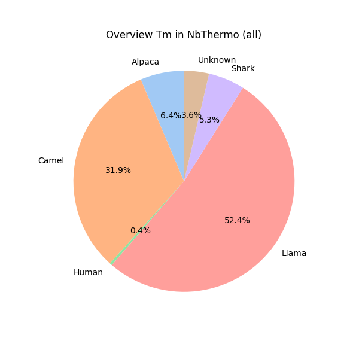
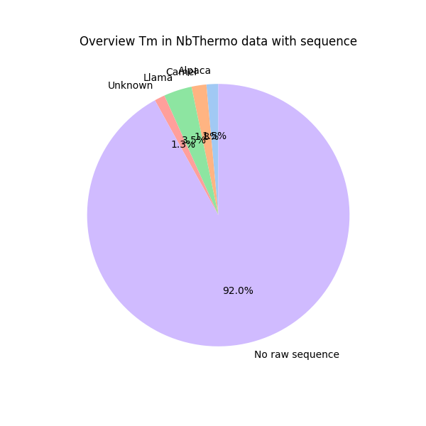
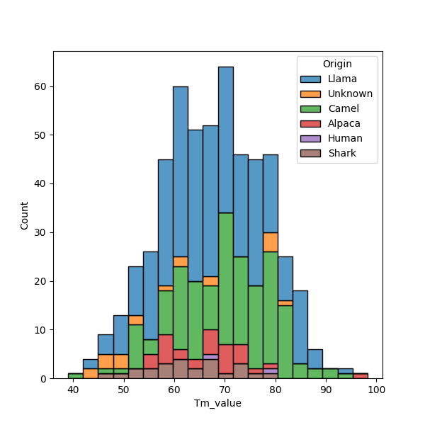

## NbThermo database content

The database contains mostly nanobodies from  Camelidae family (90%).

The metadata contains experimental values for the melting temperature (Tm) of the antibodies, however for most entries no nanobody sequence is available (more than 92%).

The analysis of the experimental Tm shows that there is a difference in the average Tm per species. Sharks have the lowest mean Tm and Camels have the highest average Tm.

| Species | mean | std | 
|----------|----------|----------|
| Llama | 66.9 | 9.9 |
| Camel | 70.2 | 9.6 |
| Alpaca | 66.7 | 8.9 |
| Shark | 62.6 | 8.1 |

Source: `scripts/1_GetJson.ipynb`.