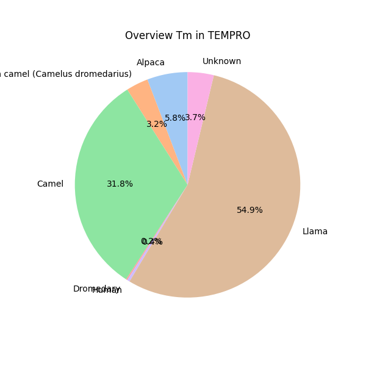
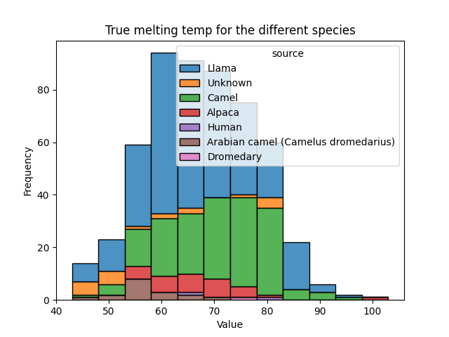
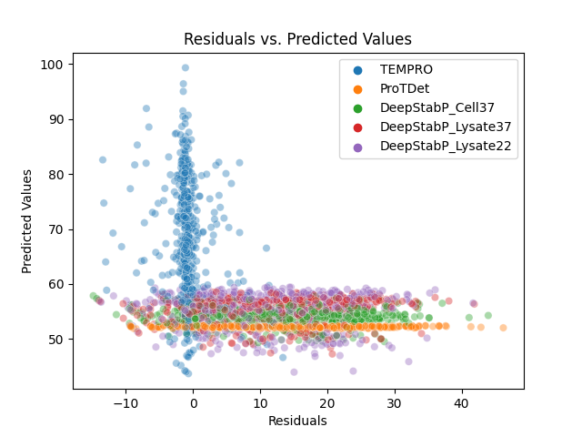

## Residual analysis for TEMPRO, ProTDet and DeepStabP models using for the nanobodies Tm predictions from paper [2]

To identify potential flaws in predicting nanobody Tms, we performed residual analysis on three models described in [2]: TEMPRO, specifically designed for nanobody Tm prediction, and two general protein models, ProTDet and DeepStabP, which are not trained on nanobody Tms.

For the residual analysis, we assessed:

- The mean and standard deviation of TEMPRO's predictions.
- Whether the residuals for TEMPRO and the other two models are randomly scattered around zero or display patterns.
- The presence of outliers indicating large errors for specific data points across all models.

The nanobodies Tm dataset described in [2] contains the following species:


The species Tm's distribution revealed that Camel have a higher average Tm (70 degrees) compared to Llama or Alpacas (~66 degrees).



The Mean and STD calculation for TEMPRO predictions suggest that Camel nanobodies Tms are harder to predict. Below are the uncertainty measures (MAE, MSE, RMSE) for Alpaca, Camel and Llama:

```
Alpaca
Prediction datasize 31
Mean Absolute Error: 1.0924788387096769
Mean Squared Error: 2.1614544483821905
Root Mean Squared Error: 1.470188575789579

Camel
Prediction datasize 170
Mean Absolute Error: 2.065171144352941
Mean Squared Error: 10.091908573632075
Root Mean Squared Error: 3.1767764437605734

Llama
Prediction datasize 293
Mean Absolute Error: 1.629867785358362
Mean Squared Error: 8.368516489961369
Root Mean Squared Error: 2.892838828894788
```

Residual analysis shows that TEMPRO's residuals are randomly distributed around zero, indicating accurate Tm predictions for species in the training data. In contrast, ProTDet and DeepStabP, which are not trained on nanobodies, exhibit large prediction errors clustered between 50 and 60 degrees, highlighting their limited performance.

TEMPRO shows a 3% outlier rate, where a outlier is defined as residuals not in range [-2,2].



```	
Model               mean        std
DeepStabP_Cell37	13.100793	10.104349
DeepStabP_Lysate22	11.880261	9.582968
DeepStabP_Lysate37	11.956179	9.601532
ProTDet	            14.920966	10.045702
TEMPRO	            -0.818024	2.794645
```

### Conclusions:

Models like ProTDet and DeepStabP are limited in predicting nanobody Tms, as they are trained on general protein data rather than nanobodies specifically. TEMPRO, however, shows better accuracy for predicting nanobody Tms in species like Camels, Llamas, and Alpacas because it has been trained on these species.

Camels nanobody seem to be harder to predict compared to Llamas or Alpacas.

Source: `scripts/2_Uncertainty_ComparisonInitialModels.ipynb`.